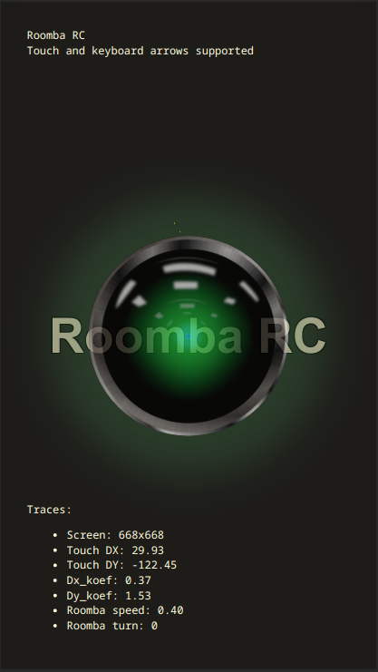

Roomba RC
=========

Web app for control roomba as RC model via touchpad or keyboard.  
Just for fun project. 

Web browser UI
--------------



Install and run
---------------

- Connect to roomba via USB-tty adapter and Open Interface (OI) (see links)
- Install dependencies
  ```shell
  # For non-root access to /dev/ttyUSB0 (tested on Ubuntu 20.04)
  sudo usermod -a -G dialout <USERNAME>  
     
  pip3 install -r requirements.txt
  python3 main.py
  ```

Links
- https://www.irobotweb.com/~/media/MainSite/PDFs/About/STEM/Create/iRobot_Roomba_600_Open_Interface_Spec.pdf
